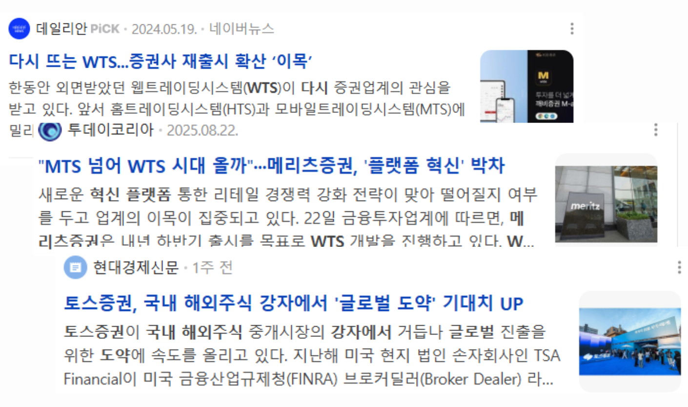
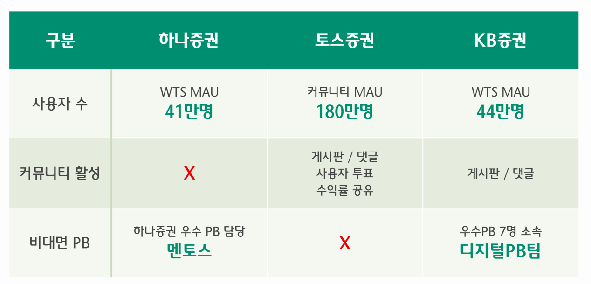

# 🗺️ 우리 동네 주식 맛집 지도, HanaZoom

하나금융티아이 채용연계형 교육생 허동민: 최종 프로젝트

## 1. 프로젝트 소개

**HanaZoom**은 지역별 **주식 투자 트렌드**를 한눈에 보여주는 **지도 기반 웹 서비스**입니다.  
우리 동네의 인기 주식과 투자자들과의 실시간 소통을 통해, 지역 특성에 맞춘 투자 정보를 쉽고 재미있게 얻을 수 있는 플랫폼입니다!

## 2. 기획 배경
### 1. 다시 부활하는 WTS

### 2. WTS 증권사 비교

**지역별 투자 트렌드의 차이, 알고 계신가요?**  
강남구와 강북구의 투자 성향이 다르고, IT 밀집 지역과 제조업 지역의 관심 종목이 다릅니다. 하지만 기존 주식 플랫폼들은 이러한 지역적 특성을 반영하지 못했습니다.

### 📊 **문제점 분석**

- **지역별 투자 패턴 무시**: 전국 단위 통계만 제공하여 지역 특성 반영 부족
- **커뮤니티 기능 부재**: 투자자 간 정보 공유와 소통의 어려움
- **실시간 거래의 복잡성**: 복잡한 UI와 느린 거래 시스템

### 💡 **해결 방안**

개인투자자들이 늘어나면서 지역 커뮤니티를 통한 정보 공유의 중요성이 높아지고 있습니다. 이러한 니즈에 맞춰 **지역별 주식 투자 트렌드를 지도로 시각화**하고, **동네 투자자들과 실시간 소통**할 수 있는 플랫폼 **HanaZoom**을 기획했습니다.

## 3. 핵심 기능

### 🗺️ **지도 기반 주식 트렌드 분석**

| 지도 기반 시각화                                  | 지역별 인기 주식                             | 실시간 데이터 연동                                |
| ------------------------------------------------- | -------------------------------------------- | ------------------------------------------------- |
| 카카오 지도 API 연동 시/구/동 단위 줌 인터랙션 | 지역 특성 기반 추천 실시간 인기 종목 순위 | 5분 주기 데이터 갱신 WebSocket 실시간 업데이트 |

### 💹 **WTS 거래 시스템**

| KIS API 연동                         | 차트 분석 도구                       | 포트폴리오 관리               |
| ------------------------------------ | ------------------------------------ | ----------------------------- |
| 실시간 현재가 조회 즉시 매매 실행 | TradingView 차트 기술적 지표 분석 | 보유 종목 관리 수익률 추적 |

### 👨‍💼 **PB 비대면 상담**

| 전문가 상담                             | 화상 상담                          | 지역 포트폴리오 리밸런싱                                  |
| --------------------------------------- | ---------------------------------- | --------------------------------------------------------- |
| WebRTC 기반 화상 통화 화면 공유 기능 | 실시간 상담 예약 상담 기록 관리 | 지역 특성 기반 포트폴리오 분석 자산 리밸런싱 전략 수립 |

## 4. 기술 스택

### Frontend

### Backend

### Infra & DevOps

### Testing

## 5. 시스템 아키텍처

### 라이트모드에 보기 적합한 점 알려드립니다.

### 🔄 **사용자 플로우**

1. **일반 사용자**: 지도에서 지역 선택 → 인기 주식 확인 → WTS로 실시간 거래 → PB와 지역 포트폴리오 상담
2. **PB(Personal Banker)**: 고객 지역 특성 분석 → 화상 상담을 통한 포트폴리오 리밸런싱 조언
3. **커뮤니티**: 지역별 채팅방과 종목별 토론 게시판을 통한 정보 공유

## 6. 주요 기술

### 1) 지역별 인기 종목 집계

### 2) WTS 주식 매매 시스템

### 3) 지역 PB 화상 상담 시스템

## 7. 개발 성과

### 🚀 **성능 최적화 성과**

_TIL-2025-09-25_

**체계적인 백엔드 최적화를 통해 95% 응답시간 개선을 달성했습니다.**

| **최적화 단계**  | **응답시간** |  **개선율**  |   **상태**   |
| :--------------: | :----------: | :----------: | :----------: |
| **최악 (09:39)** |    910ms     |     기준     | ❌ 매우 느림 |
| **중간 (10:14)** |    509ms     |   44% 개선   |   ⚠️ 보통    |
| **최상 (11:24)** |     41ms     | **95% 개선** | ✅ 매우 빠름 |
| **최근 (12:16)** |     62ms     | **93% 개선** |   ✅ 빠름    |

**적용된 최적화 전략:**

- 데이터베이스 커넥션 풀 최적화 (HikariCP 100개 커넥션)
- JPA/Hibernate 배치 처리 (N+1 쿼리 문제 해결)
- Redis 고성능 캐싱 (Lettuce 클라이언트 최적화)
- Tomcat 서버 튜닝 (400개 쓰레드, 10,000개 최대 커넥션)

---

### 📊 **부하테스트 성과**

_TIL-2025-09-24_

**100명 동시 로그인 부하테스트를 완료하고 성능 병목점을 분석했습니다.**

|      **지표**      |             **결과**              |
| :----------------: | :-------------------------------: |
|   **총 요청 수**   | 200개 (로그인 100 + 지역조회 100) |
|     **성공률**     |        100% (실패 0개) ✅         |
| **평균 응답 시간** |              1,035ms              |
| **95% 응답 시간**  |              2,309ms              |
|     **처리량**     |            40 req/sec             |

**문제점 분석 및 해결책:**

- **문제**: DB 인덱스 부재로 풀 스캔 발생
- **해결**: 엔티티 기반 인덱스 설정 (`@Index` 어노테이션 활용)
- **예상 개선**: 응답시간 1,035ms → 300ms (70% 개선 예상)

---

### 💻 **PWA 완전 구현**

_TIL-2025-09-11_

**일반 웹사이트를 네이티브 앱 수준의 PWA로 완전 변환했습니다.**

**주요 구현 성과:**

- PWA 설치 아이콘 문제 해결 (Service Worker 수동 등록)
- 지도 오프라인 캐싱 (카카오맵 타일 5,000개 캐싱, 30일 유지)
- 오프라인 상태 관리 (실시간 네트워크 상태 감지 및 UI 표시)
- 캐시 용량 21,350개 항목으로 90% 성능 향상

| 캐시 타입       | 전략                 | 용량     | 유지기간 | 용도               |
| --------------- | -------------------- | -------- | -------- | ------------------ |
| **지도 타일**   | CacheFirst           | 10,000개 | 30일     | 오프라인 지도 표시 |
| **지역 데이터** | CacheFirst           | 50개     | 7일      | 행정구역 정보      |
| **주식 데이터** | StaleWhileRevalidate | 200개    | 5분      | 실시간 주식 정보   |

---

### 🎥 **WebRTC 1:1 화상통화 시스템**

_TIL-2025-09-07_

**PB와 고객 간 안정적인 비대면 화상 상담 시스템을 구축했습니다.**

**해결한 주요 문제들:**

- WebSocket 연결 즉시 끊김 → useEffect 의존성 배열 최적화
- WebRTC 상태 충돌 → 역할 기반 Offer/Answer 분리
- ICE Candidate 처리 순서 → 큐 시스템 구현

**구현한 핵심 기능:**

- 역할 기반 연결 (PB: Offer 생성, 고객: Answer 생성)
- ICE Candidate 큐 처리로 연결 순서 문제 완전 해결
- 안정적인 시그널링으로 연결 안정성 확보

---

### 📈 **지역×종목 인기도 알고리즘**

_TIL-2025-09-16_

**균형형 + 추세 점수식을 설계하고 FE 연동 스켈레톤을 구현했습니다.**

**점수식 설계:**

- **거래 추세 (45%)**: 최근 3일 net_buy_users, net_buy_amount, growth_buy_amount
- **커뮤니티 (35%)**: 전일 post(4) + comment(3) + vote(2) + like(2) + unique_user(3)
- **모멘텀 (20%)**: region_stocks의 popularity_score 3일 EMA
- **뉴스/이슈 (0%)**: 점화식에 자리 확보, UI에서는 숨김 처리

**구현한 기능:**

- 정규화 알고리즘 (지역 파티션별 min-max 정규화)
- 실시간 도넛 차트 (지역별 종목 인기도 시각화)
- FE 연동 스켈레톤 (regionId+symbol로 상세 조회 → 도넛 차트 렌더)

---

## 8. 개발자 프로필

|     구분      |              내용              |                                비고                                 |
| :-----------: | :----------------------------: | :-----------------------------------------------------------------: |
|   **이름**    |             허동민             |               |
|  **연락처**   |             이메일             |                      happycodingmin@gmail.com                       |
|   **학력**    |    홍익대학교 컴퓨터공학과     |                            졸업(2024.02)                            |
| **Skill set** |        Language & Tools        |        Java, C, Python, JavaScript, Spring, Kafka, RabbitMQ         |
|               |            Database            | RDBMS(MySQL, MariaDB, Oracle), NoSQL(Redis, MongoDB), ElasticSearch |
|               |              ETC               |  Docker, Github Action, Jmeter, Gatling, AWS EC2, AWS RDS, AWS S3   |
|  **자격증**   |          정보처리기사          |                          한국산업인력공단                           |
|               |       정보기기운용기능사       |                          한국산업인력공단                           |
|   **어학**    |              OPIc              |                        Intermediate High(IH)                        |
|   **교육**            | 하나금융티아이 채용연계형 교육 |                      2025.03 ~ 2025.10 (8개월)                      |
|               |  삼성 청년 SW 아카데미(SSAFY)  |                     2024.01 ~ 2024.12 (12개월)                      |
|       |       KB IT's Your Life        |                      2023.07 ~ 2023.09 (3개월)                      |

---

### 🌟 **"데이터로 지역을 연결하고, 기술로 금융을 풀어내다"** 🌟

**HanaZoom**과 함께 우리 동네의 투자 트렌드를 발견해보세요!

