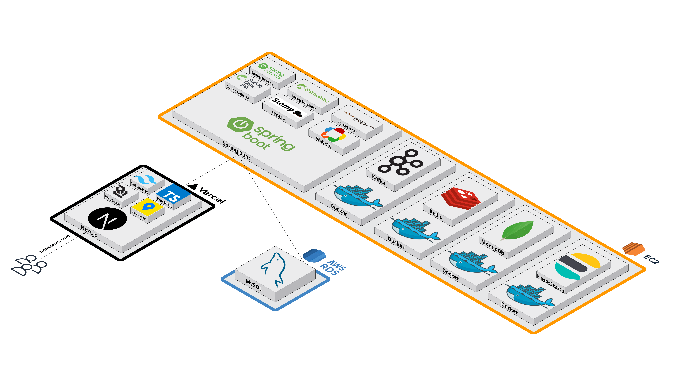

# HanaZoom Backend

HanaZoom 백엔드 서버는 Spring Boot 3.2.3 기반으로 구축된 우리 동네 주식 맛집 지도 서비스 / WTS 플랫폼 / 디지털 PB 상담 서비스의 API 서버입니다.

## 🛠 기술 스택

- **Framework**: Spring Boot 3.2.3
- **Java**: OpenJDK 17
- **Build Tool**: Gradle 7.6.1
- **Database**: MySQL 8.0 (메인 DB), MongoDB 7.0 (채팅), Redis 7 (캐시)
- **Message Queue**: Apache Kafka
- **Search Engine**: Elasticsearch 8.11.0
- **Security**: Spring Security + JWT
- **Real-time**: WebSocket + STOMP

## 📋 사전 요구사항

### 필수 소프트웨어
- **Java 17** 이상
- **Docker & Docker Compose** (인프라 서비스용)
- **Gradle 7.6.1** 이상

### 환경 변수 설정
프로젝트 루트에 `.env` 파일을 생성하고 다음 환경 변수들을 설정하세요:

```bash
# 한국투자증권 API 키 (필수)
KIS_APP_KEY=your_kis_app_key
KIS_APP_SECRET=your_kis_app_secret
KIS_ACCOUNT_CODE=your_account_code
KIS_PRODUCT_CODE=your_product_code

# 카카오 API 키 (선택사항 - 기본값 있음)
KAKAO_REST_API_KEY=your_kakao_rest_api_key
KAKAO_OAUTH_CLIENT_ID=your_kakao_oauth_client_id
KAKAO_OAUTH_CLIENT_SECRET=your_kakao_oauth_client_secret
KAKAO_OAUTH_REDIRECT_URI=http://localhost:3000/auth/kakao/callback

# 데이터베이스 설정 (Docker Compose 사용 시 기본값 사용 가능)
DB_USERNAME=hanazoom_user
DB_PASSWORD=hanazoom1234!
DB_ROOT_PASSWORD=hanazoom1234!

# Redis 설정
REDIS_PASSWORD=redis1234!

# MongoDB 설정
MONGO_ROOT_USERNAME=admin
MONGO_ROOT_PASSWORD=admin1234!
MONGO_USERNAME=hanazoom_mongo
MONGO_PASSWORD=mongo1234!
```

## 🚀 시작하기

### 1. 인프라 서비스 시작

프로젝트 루트에서 다음 명령어로 필요한 미들웨어들을 시작합니다:

```bash
# 인프라 서비스 시작 (MySQL, Redis, MongoDB, Kafka, Elasticsearch)
cd Infra
docker-compose up -d

# 서비스 상태 확인
docker-compose ps
```

**필요한 서비스들:**
- **MySQL** (포트: 3306) - 메인 데이터베이스
- **Redis** (포트: 16380) - 캐시 및 세션 저장소
- **MongoDB** (포트: 27017) - 채팅 히스토리 저장소
- **Kafka** (포트: 9092) - 실시간 데이터 스트리밍
- **Zookeeper** (포트: 2181) - Kafka 의존성
- **Elasticsearch** (포트: 19200) - 주식 검색 엔진
- **Kibana** (포트: 15601) - Elasticsearch 시각화 도구

### 2. 백엔드 서버 실행

```bash
# BE 디렉토리로 이동
cd BE/HanaZoom

# Gradle Wrapper를 사용한 빌드 및 실행
./gradlew bootRun

# 또는 JAR 파일로 실행
./gradlew build
java -jar build/libs/HanaZoom-0.0.1-SNAPSHOT.jar
```

### 3. 서버 상태 확인

서버가 정상적으로 시작되면 다음 엔드포인트에서 상태를 확인할 수 있습니다:

- **Health Check**: `http://localhost:8080/health`

## 🔧 개발 환경 설정

### IDE 설정 (IntelliJ IDEA 권장)

1. **Java 17 SDK 설정**
2. **Gradle 프로젝트로 Import**
3. **Lombok 플러그인 설치 및 활성화**
4. **Spring Boot 플러그인 활성화**

## 📁 프로젝트 구조

```
BE/HanaZoom/src/main/java/com/hanazoom/
├── global/                 # 전역 설정 및 유틸리티
│   ├── config/            # Spring 설정 클래스들
│   ├── controller/        # 공통 컨트롤러
│   ├── exception/         # 예외 처리
│   ├── security/          # 보안 관련
│   └── util/              # 유틸리티 클래스들
├── domain/                # 도메인별 비즈니스 로직
│   ├── auth/              # 인증/인가
│   ├── chat/              # 채팅 기능
│   ├── community/         # 커뮤니티
│   ├── order/             # 주문 관리
│   ├── portfolio/         # 포트폴리오
│   ├── stock/             # 주식 관련
│   └── user/              # 사용자 관리
└── HanaZoomApplication.java # 메인 애플리케이션 클래스
```
## 🏗 시스템 아키텍처


## 🔑 주요 API 엔드포인트

### 인증 관련
- `POST /api/auth/login` - 로그인
- `POST /api/auth/signup` - 회원가입
- `POST /api/auth/refresh` - 토큰 갱신

### 주식 관련
- `GET /api/stocks` - 주식 목록 조회
- `GET /api/stocks/{code}/price` - 주식 가격 조회
- `GET /api/stocks/{code}/chart` - 주식 차트 데이터

### 포트폴리오
- `GET /api/portfolio` - 포트폴리오 조회
- `POST /api/portfolio/orders` - 주문 생성

### 커뮤니티
- `GET /api/community/posts` - 게시글 목록
- `POST /api/community/posts` - 게시글 작성

## 🐛 문제 해결

### 자주 발생하는 문제들

1. **포트 충돌**
   ```bash
   # 포트 사용 중인 프로세스 확인
   netstat -ano | findstr :8080
   # 프로세스 종료
   taskkill /PID <PID> /F
   ```

2. **데이터베이스 연결 실패**
   ```bash
   # Docker 서비스 상태 확인
   docker-compose ps
   # 로그 확인
   docker-compose logs db
   ```

3. **Kafka 연결 실패**
   ```bash
   # Kafka 컨테이너 로그 확인
   docker-compose logs kafka
   # Zookeeper 상태 확인
   docker-compose logs zookeeper
   ```

4. **메모리 부족**
   ```bash
   # Gradle 빌드 시 메모리 제한 설정
   ./gradlew build -Dorg.gradle.jvmargs="-Xmx2g"
   ```

### 로그 확인

- **애플리케이션 로그**: `/var/log/hanazoom/backend.log`
- **Docker 로그**: `docker-compose logs <service_name>`

## 🧪 테스트

```bash
# 단위 테스트 실행
./gradlew test

# 통합 테스트 실행
./gradlew integrationTest

# 모든 테스트 실행
./gradlew check
```

## 📦 빌드 및 배포

### Docker 이미지 빌드

```bash
# Docker 이미지 빌드
docker build -t hanazoom-backend .

# Docker Compose로 실행
docker-compose up -d
```

### 프로덕션 빌드

```bash
# 프로덕션용 JAR 빌드
./gradlew build -Pprofile=prod

# 프로덕션 실행
java -jar -Dspring.profiles.active=prod build/libs/HanaZoom-0.0.1-SNAPSHOT.jar
```

